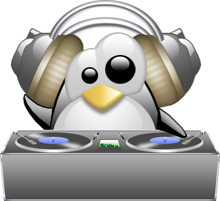

% Produção Musical de Qualidade no Linux
% Lucas Fialho Zawacki

# Quem vos fala?

* Lucas Fialho Zawacki
* Formado em Ciência da Computação pela UFRGS
* Membro do Matehackers (<http://matehackers.org>)
* Software Livre na veia!

# Contatos

## <http://blog.lfzawacki.com>
## <http://soundcloud.com/lfzawacki>
## @lfzawacki (gmail, twitter, whatever)

# Nesta palestra eu vou:

* Falar um pouco sobre o Linux
* Sobre o hardware necessário
* Demonstrar o software
* Criar algo aqui na hora para vocês

# Linux e Música

Em minha opinião a situação da música no Linux não é perfeita, mas é muito boa!

* Muitos softwares de qualidade e gratuitos
* Infraestrutura moderna de conexão (Jack) e plugins (LV2)
* Comunidade não muito grande, mas crescendo

# Ambiente de Áudio

A situação já foi pior, mas ainda está meio bagunçada. Diversos
"sistemas de áudio" concorrentes e programas que trabalham mais ou menos com cada um deles.

* alsa
* pulseaudio
* oss
* outros...

# Ambiente para Música

No entanto, quando o assunto é produção musical a coisa é mais organizada. Temos
alguns padrões como a arquitetura do [Jack](http://jackaudio.org/) e os plugins [LADSPA](http://www.ladspa.org/) e [LV2](http://lv2plug.in/).

* Programas usando padrões bem documentados
  * MIDI
  * OGG
  * OSC

# Primeiros passos

## Distro

Suporte de software é muito importante. Qualquer uma mais atualizada e popular deve servir.

Ubuntu, Mint, Debian, Fedora ...

## Hardware

Muito importante tomar cuidado ao comprar, pois nem todos são compatíveis.

# Montado o meu setup

# [Audacity](http://audacity.sourceforge.net/)

* Ótimo para gravar
* Perfeito para editar clipes de áudio

# O que é o [Jack](http://jackaudio.org/)?

* É um software muito maneiro :)
* Faça o roteamento de som entre diferentes aplicativos

# [Guitarix](http://guitarix.sourceforge.net/) e [Rakkarack](http://rakarrack.sourceforge.net/)

* Porque eu sei que tem muitos guitarristas por aí!

# [ZynAddSubFX](http://sourceforge.net/projects/zynaddsubfx/), [Bristol](http://bristol.sourceforge.net/about.html), [QSynth](http://qsynth.sourceforge.net/qsynth-index.html) e outros synths

* Síntese sonora por software
* Geralmente controle por MIDI

# DAWs

* Rosegarden
* Muse
* Ardour
* Qtractor
* e outros ...

# [Qtractor](http://qtractor.sourceforge.net/qtractor-index.html)

* Gravação e Importação de Áudio
* Gravação e Reprodução de MIDI
* Boa interface
* Ótimo suporte a plugins 
* Em desenvolvimento ativo

# Um projeto simples

## :)

# Plugins

* Reverb
* Delay
* Simulação de válvulas, mesas de gravação
* Sintetizadores ...

# Referências

* [Compatibilidade de Hardware](http://linuxstudiopro.com/)
* [Tutoriais de Música Livre](http://blog.matehackers.org/tutoriais-de-musica-livre/)
* [Linux Musicians](wiki.linuxmusicians.com)
* [Links sobre computação e música](http://lfzawacki.heroku.com/life/show/Computer+Music)